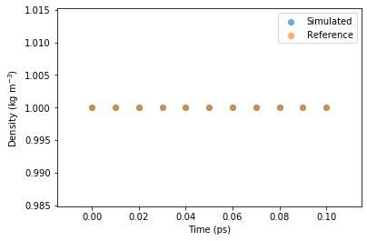

# Using CHARMM-GUI + MoSDeF + GROMACS + MDTraj
This workflow covers obtaining pre-parametrized structures via CHARMM-GUI,
initializing a system using mBuild, writing the appropriate input files for GROMACS,
running a simulation with GROMACS, and analyzing a trajectory with MDTraj

Outside of the scope of this work is using CHARMM-GUI, 
but we will assume we have designed and parametrized an ethane molecule via CHARMM-GUI
based on the CHARMM force field. The resultant output has relevant parameter and input files for
OpenMM, NAMD, CHARMM, and GROMACS. We are also given some structural coordinates for an ethane molecule. 

In this workflow, we are working with the GROMACS simulation package, so we are interested in the ITP files,
`files/ETHA.itp` and `files/charmm36.itp`, as well as the MOL2 file, `files/ethane.mol2`. 

The ITP files contain all the relevant force field information for a simulation, 
while the MOL2 file serves as a prototype for constructing an `mb.Compound`


```python
import mbuild as mb
```

## Constructing our mb.Compound subclass
In this situation, we do not need to construct particles and overlap ports. 
Instead, we can load coordinates/bonding information from the MOL2 file.
We can also set the name of the compound to be consistent with `files/ETHA.itp`


```python
class charmm_ethane(mb.Compound):
    def __init__(self):
        super(charmm_ethane, self).__init__()
        mb.load('files/ethane.mol2', compound=self)
        self.name='ETHA'
```

## Re-using this class

We will use mBuild functionality to construct a larger mb.Compound by filling a box with these ethane molecules.


```python
prototype = charmm_ethane()
n_ethane = 100
ethane_box = mb.fill_box(compound=prototype, n_compounds=n_ethane, density=1)
```

    /Users/ayang41/Programs/mdtraj/mdtraj/formats/mol2.py:203: FutureWarning: read_table is deprecated, use read_csv instead.
      index_col=0, header=None, sep="\s+", engine='python')


## Writing coordinates to disk
We can `save` this compound to disk in a variety of file formats. Since we are performing a GROMACS simulation, we will save the coordinates to a `gro` file, additionally specifying residue names.


```python
ethane_box.save('box.gro', residues=['ETHA'], overwrite=True)
```

## Writing force field information to disk
By using the #include statement functionality in gromacs, we can write a fairly simple `top` file.
This `top` file will pull force field parameters from `files/charmm36.itp` and `files/ETHA.itp`.

In this example, the use of `ITP` files helps streamline the force field parametrization process
because these compounds were already parametrized


```python
with open('box.top', 'w') as f:
    f.write("#include \"files/charmm36.itp\" \n")
    f.write("#include \"files/ETHA.itp\" \n")
    f.write("[ System ] \n")
    f.write('mBuild box of ethane\n')
    f.write("[ Molecules ] \n")
    f.write("{} {}".format(prototype.name, n_ethane))
```

## Perform energy minimization and NPT simulation in GROMACS
This is an uninteresting system with very few timesteps, but we will continue with the simulation steps


```python
!gmx grompp -f files/em.mdp -c box.gro -p box.top -o em -maxwarn 1
```

                          :-) GROMACS - gmx grompp, 2018.1 (-:
    
                                GROMACS is written by:
         Emile Apol      Rossen Apostolov      Paul Bauer     Herman J.C. Berendsen
        Par Bjelkmar    Aldert van Buuren   Rudi van Drunen     Anton Feenstra  
      Gerrit Groenhof    Aleksei Iupinov   Christoph Junghans   Anca Hamuraru   
     Vincent Hindriksen Dimitrios Karkoulis    Peter Kasson        Jiri Kraus    
      Carsten Kutzner      Per Larsson      Justin A. Lemkul    Viveca Lindahl  
      Magnus Lundborg   Pieter Meulenhoff    Erik Marklund      Teemu Murtola   
        Szilard Pall       Sander Pronk      Roland Schulz     Alexey Shvetsov  
       Michael Shirts     Alfons Sijbers     Peter Tieleman    Teemu Virolainen 
     Christian Wennberg    Maarten Wolf   
                               and the project leaders:
            Mark Abraham, Berk Hess, Erik Lindahl, and David van der Spoel
    
    Copyright (c) 1991-2000, University of Groningen, The Netherlands.
    Copyright (c) 2001-2017, The GROMACS development team at
    Uppsala University, Stockholm University and
    the Royal Institute of Technology, Sweden.
    check out http://www.gromacs.org for more information.
    
    GROMACS is free software; you can redistribute it and/or modify it
    under the terms of the GNU Lesser General Public License
    as published by the Free Software Foundation; either version 2.1
    of the License, or (at your option) any later version.
    
    GROMACS:      gmx grompp, version 2018.1
    Executable:   /Users/ayang41/Programs/gromacs-2018.1/installation/bin/gmx
    Data prefix:  /Users/ayang41/Programs/gromacs-2018.1/installation
    Working dir:  /Users/ayang41/Programs/mosdef-workflows/charmm-gui-gmx
    Command line:
      gmx grompp -f files/em.mdp -c box.gro -p box.top -o em -maxwarn 1
    
    
    NOTE 1 [file files/em.mdp]:
      With Verlet lists the optimal nstlist is >= 10, with GPUs >= 20. Note
      that with the Verlet scheme, nstlist has no effect on the accuracy of
      your simulation.
    
    Setting the LD random seed to -31714273
    Generated 3 of the 3 non-bonded parameter combinations
    Generating 1-4 interactions: fudge = 1
    Generated 1 of the 3 1-4 parameter combinations
    Excluding 3 bonded neighbours molecule type 'ETHA'
    Warning: atom name 1 in box.top and box.gro does not match (H13 - C)
    Warning: atom name 2 in box.top and box.gro does not match (C1 - C)
    Warning: atom name 3 in box.top and box.gro does not match (C2 - H)
    Warning: atom name 4 in box.top and box.gro does not match (H21 - H)
    Warning: atom name 5 in box.top and box.gro does not match (H22 - H)
    Warning: atom name 6 in box.top and box.gro does not match (H23 - H)
    Warning: atom name 7 in box.top and box.gro does not match (H11 - H)
    Warning: atom name 8 in box.top and box.gro does not match (H12 - H)
    Warning: atom name 9 in box.top and box.gro does not match (H13 - C)
    Warning: atom name 10 in box.top and box.gro does not match (C1 - C)
    Warning: atom name 11 in box.top and box.gro does not match (C2 - H)
    Warning: atom name 12 in box.top and box.gro does not match (H21 - H)
    Warning: atom name 13 in box.top and box.gro does not match (H22 - H)
    Warning: atom name 14 in box.top and box.gro does not match (H23 - H)
    Warning: atom name 15 in box.top and box.gro does not match (H11 - H)
    Warning: atom name 16 in box.top and box.gro does not match (H12 - H)
    Warning: atom name 17 in box.top and box.gro does not match (H13 - C)
    Warning: atom name 18 in box.top and box.gro does not match (C1 - C)
    Warning: atom name 19 in box.top and box.gro does not match (C2 - H)
    Warning: atom name 20 in box.top and box.gro does not match (H21 - H)
    (more than 20 non-matching atom names)
    
    WARNING 1 [file box.top, line 6]:
      800 non-matching atom names
      atom names from box.top will be used
      atom names from box.gro will be ignored
    
    
    Removing all charge groups because cutoff-scheme=Verlet
    Analysing residue names:
    There are:   100      Other residues
    Analysing residues not classified as Protein/DNA/RNA/Water and splitting into groups...
    Number of degrees of freedom in T-Coupling group rest is 2397.00
    Calculating fourier grid dimensions for X Y Z
    Using a fourier grid of 144x144x144, spacing 0.119 0.119 0.119
    Estimate for the relative computational load of the PME mesh part: 1.00
    
    NOTE 2 [file files/em.mdp]:
      The optimal PME mesh load for parallel simulations is below 0.5
      and for highly parallel simulations between 0.25 and 0.33,
      for higher performance, increase the cut-off and the PME grid spacing.
    
    
    This run will generate roughly 0 Mb of data
    
    There were 2 notes
    
    There was 1 warning
    
    Back Off! I just backed up em.tpr to ./#em.tpr.1#
    
    GROMACS reminds you: "Base eight is just like base ten really, if you’re missing two fingers." (Tom Lehrer)
    


```python
!gmx mdrun -deffnm em
```

                          :-) GROMACS - gmx mdrun, 2018.1 (-:
    
                                GROMACS is written by:
         Emile Apol      Rossen Apostolov      Paul Bauer     Herman J.C. Berendsen
        Par Bjelkmar    Aldert van Buuren   Rudi van Drunen     Anton Feenstra  
      Gerrit Groenhof    Aleksei Iupinov   Christoph Junghans   Anca Hamuraru   
     Vincent Hindriksen Dimitrios Karkoulis    Peter Kasson        Jiri Kraus    
      Carsten Kutzner      Per Larsson      Justin A. Lemkul    Viveca Lindahl  
      Magnus Lundborg   Pieter Meulenhoff    Erik Marklund      Teemu Murtola   
        Szilard Pall       Sander Pronk      Roland Schulz     Alexey Shvetsov  
       Michael Shirts     Alfons Sijbers     Peter Tieleman    Teemu Virolainen 
     Christian Wennberg    Maarten Wolf   
                               and the project leaders:
            Mark Abraham, Berk Hess, Erik Lindahl, and David van der Spoel
    
    Copyright (c) 1991-2000, University of Groningen, The Netherlands.
    Copyright (c) 2001-2017, The GROMACS development team at
    Uppsala University, Stockholm University and
    the Royal Institute of Technology, Sweden.
    check out http://www.gromacs.org for more information.
    
    GROMACS is free software; you can redistribute it and/or modify it
    under the terms of the GNU Lesser General Public License
    as published by the Free Software Foundation; either version 2.1
    of the License, or (at your option) any later version.
    
    GROMACS:      gmx mdrun, version 2018.1
    Executable:   /Users/ayang41/Programs/gromacs-2018.1/installation/bin/gmx
    Data prefix:  /Users/ayang41/Programs/gromacs-2018.1/installation
    Working dir:  /Users/ayang41/Programs/mosdef-workflows/charmm-gui-gmx
    Command line:
      gmx mdrun -deffnm em
    
    
    Back Off! I just backed up em.log to ./#em.log.1#
    Reading file em.tpr, VERSION 2018.1 (single precision)
    
    NOTE: disabling dynamic load balancing as it is only supported with dynamics, not with integrator 'steep'.
    
    Using 4 MPI threads
    
    Back Off! I just backed up em.trr to ./#em.trr.1#
    
    Back Off! I just backed up em.edr to ./#em.edr.1#
    
    Steepest Descents:
       Tolerance (Fmax)   =  1.00000e+03
       Number of steps    =        50000
    
    writing lowest energy coordinates.
    
    Back Off! I just backed up em.gro to ./#em.gro.1#
    
    Steepest Descents converged to Fmax < 1000 in 27 steps
    Potential Energy  =  4.0232490e+03
    Maximum force     =  5.3452930e+02 on atom 18
    Norm of force     =  2.4953529e+02
    
    GROMACS reminds you: "Come on boys, Let's push it hard" (P.J. Harvey)
    


```python
!gmx grompp -f files/npt.mdp -c em.gro -p box.top -o npt
```

                          :-) GROMACS - gmx grompp, 2018.1 (-:
    
                                GROMACS is written by:
         Emile Apol      Rossen Apostolov      Paul Bauer     Herman J.C. Berendsen
        Par Bjelkmar    Aldert van Buuren   Rudi van Drunen     Anton Feenstra  
      Gerrit Groenhof    Aleksei Iupinov   Christoph Junghans   Anca Hamuraru   
     Vincent Hindriksen Dimitrios Karkoulis    Peter Kasson        Jiri Kraus    
      Carsten Kutzner      Per Larsson      Justin A. Lemkul    Viveca Lindahl  
      Magnus Lundborg   Pieter Meulenhoff    Erik Marklund      Teemu Murtola   
        Szilard Pall       Sander Pronk      Roland Schulz     Alexey Shvetsov  
       Michael Shirts     Alfons Sijbers     Peter Tieleman    Teemu Virolainen 
     Christian Wennberg    Maarten Wolf   
                               and the project leaders:
            Mark Abraham, Berk Hess, Erik Lindahl, and David van der Spoel
    
    Copyright (c) 1991-2000, University of Groningen, The Netherlands.
    Copyright (c) 2001-2017, The GROMACS development team at
    Uppsala University, Stockholm University and
    the Royal Institute of Technology, Sweden.
    check out http://www.gromacs.org for more information.
    
    GROMACS is free software; you can redistribute it and/or modify it
    under the terms of the GNU Lesser General Public License
    as published by the Free Software Foundation; either version 2.1
    of the License, or (at your option) any later version.
    
    GROMACS:      gmx grompp, version 2018.1
    Executable:   /Users/ayang41/Programs/gromacs-2018.1/installation/bin/gmx
    Data prefix:  /Users/ayang41/Programs/gromacs-2018.1/installation
    Working dir:  /Users/ayang41/Programs/mosdef-workflows/charmm-gui-gmx
    Command line:
      gmx grompp -f files/npt.mdp -c em.gro -p box.top -o npt
    
    Replacing old mdp entry 'nstxtcout' by 'nstxout-compressed'
    
    NOTE 1 [file files/npt.mdp]:
      You have set rlist larger than the interaction cut-off, but you also have
      verlet-buffer-tolerance > 0. Will set rlist using verlet-buffer-tolerance.
    
    
    NOTE 2 [file files/npt.mdp]:
      Setting nstcalcenergy (100) equal to nstenergy (10)
    
    
    NOTE 3 [file files/npt.mdp]:
      leapfrog does not yet support Nose-Hoover chains, nhchainlength reset to 1
    
    Setting the LD random seed to -1139208915
    Generated 3 of the 3 non-bonded parameter combinations
    Generating 1-4 interactions: fudge = 1
    Generated 1 of the 3 1-4 parameter combinations
    Excluding 3 bonded neighbours molecule type 'ETHA'
    turning H bonds into constraints...
    Removing all charge groups because cutoff-scheme=Verlet
    Analysing residue names:
    There are:   100      Other residues
    Analysing residues not classified as Protein/DNA/RNA/Water and splitting into groups...
    Number of degrees of freedom in T-Coupling group System is 1797.00
    Determining Verlet buffer for a tolerance of 0.005 kJ/mol/ps at 300 K
    Calculated rlist for 1x1 atom pair-list as 0.900 nm, buffer size 0.000 nm
    Set rlist, assuming 4x4 atom pair-list, to 0.900 nm, buffer size 0.000 nm
    Note that mdrun will redetermine rlist based on the actual pair-list setup
    Calculating fourier grid dimensions for X Y Z
    Using a fourier grid of 144x144x144, spacing 0.119 0.119 0.119
    Estimate for the relative computational load of the PME mesh part: 1.00
    
    NOTE 4 [file files/npt.mdp]:
      The optimal PME mesh load for parallel simulations is below 0.5
      and for highly parallel simulations between 0.25 and 0.33,
      for higher performance, increase the cut-off and the PME grid spacing.
    
    
    This run will generate roughly 0 Mb of data
    
    There were 4 notes
    
    Back Off! I just backed up npt.tpr to ./#npt.tpr.5#
    
    GROMACS reminds you: "There's no kill like overkill, right?" (Erik Lindahl)
    


```python
!gmx mdrun -deffnm npt
```

                          :-) GROMACS - gmx mdrun, 2018.1 (-:
    
                                GROMACS is written by:
         Emile Apol      Rossen Apostolov      Paul Bauer     Herman J.C. Berendsen
        Par Bjelkmar    Aldert van Buuren   Rudi van Drunen     Anton Feenstra  
      Gerrit Groenhof    Aleksei Iupinov   Christoph Junghans   Anca Hamuraru   
     Vincent Hindriksen Dimitrios Karkoulis    Peter Kasson        Jiri Kraus    
      Carsten Kutzner      Per Larsson      Justin A. Lemkul    Viveca Lindahl  
      Magnus Lundborg   Pieter Meulenhoff    Erik Marklund      Teemu Murtola   
        Szilard Pall       Sander Pronk      Roland Schulz     Alexey Shvetsov  
       Michael Shirts     Alfons Sijbers     Peter Tieleman    Teemu Virolainen 
     Christian Wennberg    Maarten Wolf   
                               and the project leaders:
            Mark Abraham, Berk Hess, Erik Lindahl, and David van der Spoel
    
    Copyright (c) 1991-2000, University of Groningen, The Netherlands.
    Copyright (c) 2001-2017, The GROMACS development team at
    Uppsala University, Stockholm University and
    the Royal Institute of Technology, Sweden.
    check out http://www.gromacs.org for more information.
    
    GROMACS is free software; you can redistribute it and/or modify it
    under the terms of the GNU Lesser General Public License
    as published by the Free Software Foundation; either version 2.1
    of the License, or (at your option) any later version.
    
    GROMACS:      gmx mdrun, version 2018.1
    Executable:   /Users/ayang41/Programs/gromacs-2018.1/installation/bin/gmx
    Data prefix:  /Users/ayang41/Programs/gromacs-2018.1/installation
    Working dir:  /Users/ayang41/Programs/mosdef-workflows/charmm-gui-gmx
    Command line:
      gmx mdrun -deffnm npt
    
    
    Back Off! I just backed up npt.log to ./#npt.log.4#
    Reading file npt.tpr, VERSION 2018.1 (single precision)
    Changing nstlist from 10 to 100, rlist from 0.9 to 0.9
    
    Using 4 MPI threads
    
    Back Off! I just backed up npt.xtc to ./#npt.xtc.4#
    
    Back Off! I just backed up npt.edr to ./#npt.edr.4#
    starting mdrun 'mBuild box of ethane'
    100 steps,      0.1 ps.
    
    Writing final coordinates.
    
    Back Off! I just backed up npt.gro to ./#npt.gro.1#
    
     Dynamic load balancing report:
     DLB was off during the run due to low measured imbalance.
     Average load imbalance: 6.9%.
     The balanceable part of the MD step is 0%, load imbalance is computed from this.
     Part of the total run time spent waiting due to load imbalance: 0.0%.
    
    
                   Core t (s)   Wall t (s)        (%)
           Time:       24.527        6.132      400.0
                     (ns/day)    (hour/ns)
    Performance:        1.423       16.864
    
    GROMACS reminds you: "When I asked a younger colleague at the university how he had been able to change his research field several times within a decade or so, he answered: "It's just a question of new software"" (Paul Verhaeghe)
    


## Analyzing trajectories with MDTraj
After performing a simulation, we can read the relevant trajectory files into an `mdtraj.Trajectory` object,
an in-memory, digital representation of a trajectory.

MDTraj has a variety of functionality, but for convenience we will just compute the density of the system


```python
import mdtraj
traj = mdtraj.load('npt.xtc', top='npt.gro')
rho = mdtraj.density(traj)
```

## Validation and comparison to reference data
A reference density-timeseries is located in `files/rho.dat`. 
We can load the reference data and compare to our simulated reference data.


```python
import numpy as np
%matplotlib inline
import matplotlib
import matplotlib.pyplot as plt

ref = np.loadtxt('ref/rho.dat')
fig, ax = plt.subplots(1,1)
ax.scatter(traj.time, rho, label='Simulated', alpha=0.6)
ax.scatter(ref[:,0], ref[:,1], label='Reference', alpha=0.6)
ax.legend()
ax.set_ylabel(r"Density (kg m$^{{-3}}$)")
ax.set_xlabel("Time (ps)")
```


    Text(0.5, 0, 'Time (ps)')





## Notes
Because of how short the simulation was run, there was actually no box-resizing performed, so the density is constant and the same as how we specified in the mBuild steps (we specified a density of 1, which is consistent with the non-box-altered simulation)

# Summary
We have neatly conducted and analyzed a simulation from start to finish. 
We have built and parametrized our system using CHARMM-GUI and mBuild, simulated using GROMACS, and analyzed using MDTraj. 
Furthermore, there is clear room to work with other force field parameters, molecules, simulation engines, and analysis packages.


```python

```
